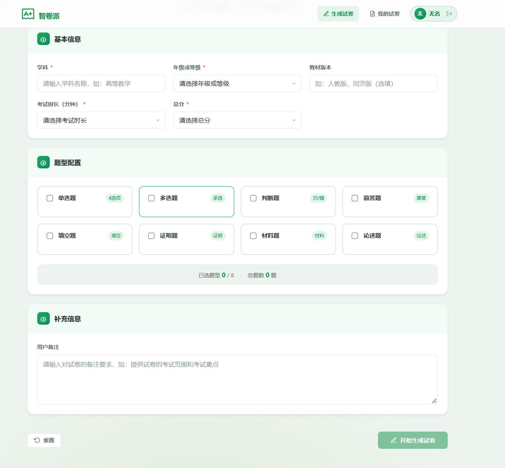
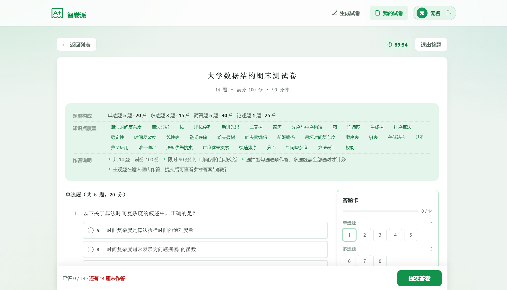
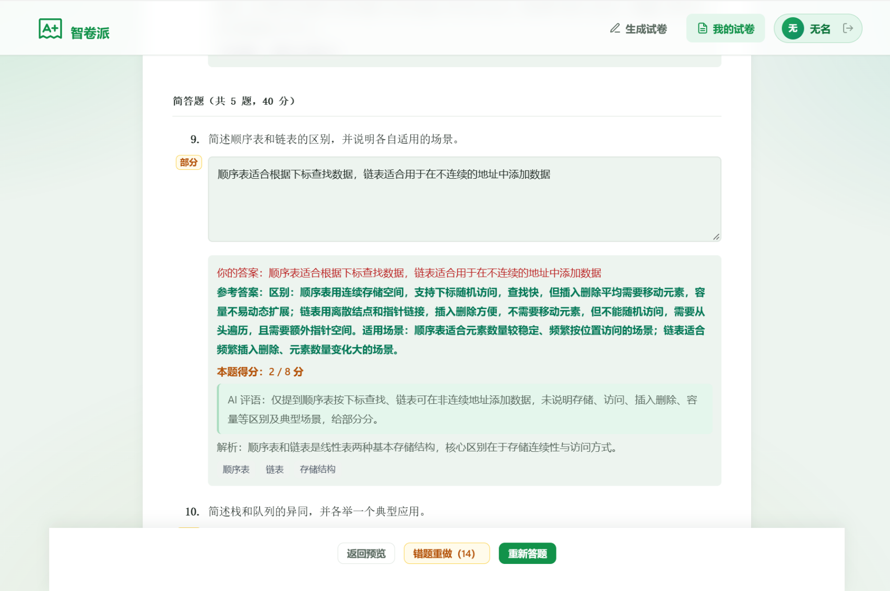
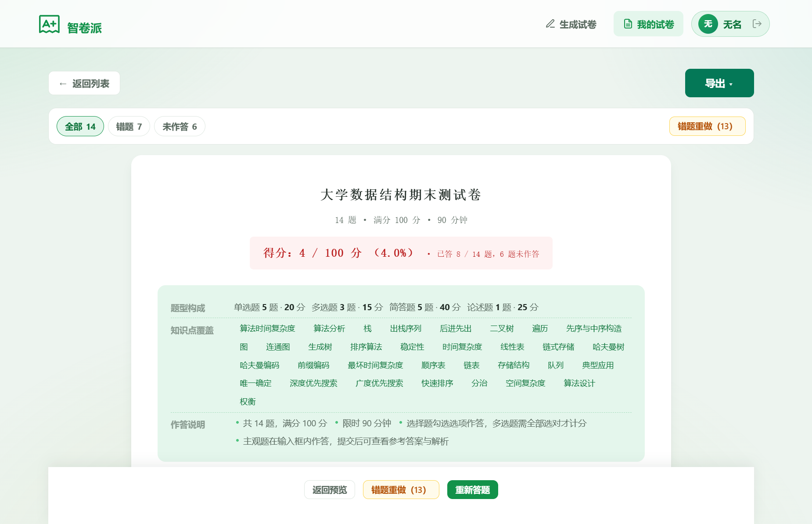
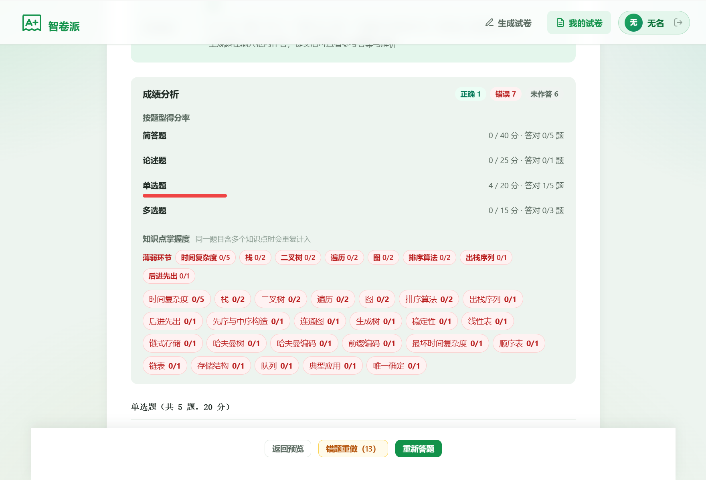
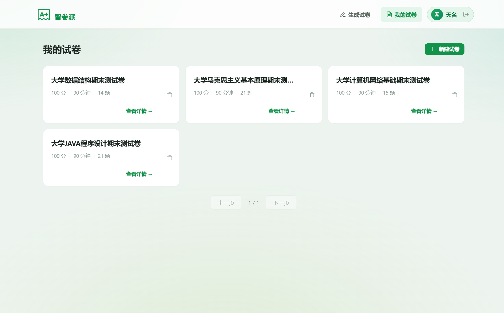
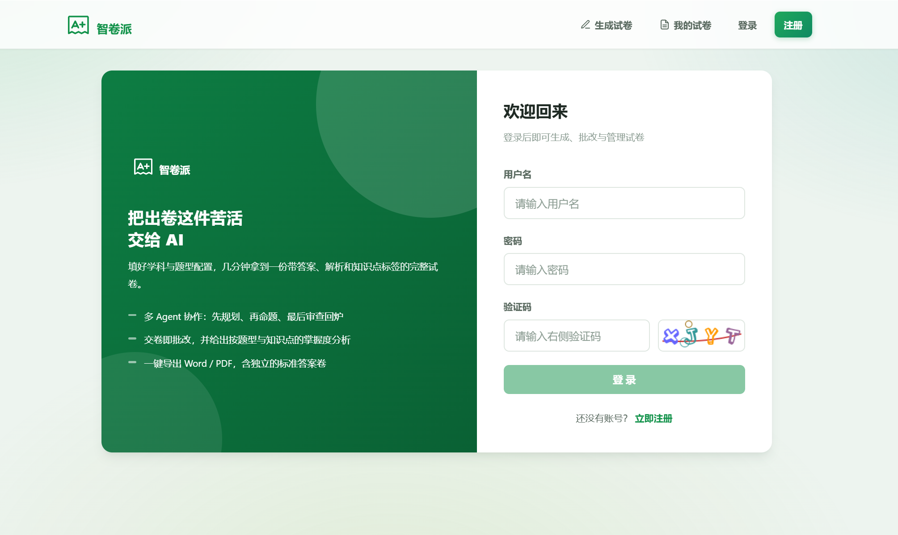

# 智卷派 · AI 智能试卷生成与批改平台


> 填写学科、年级与题型要求，由多个 AI Agent 协作产出一份结构完整、分值自洽的试卷；学生在线作答后自动批改，并给出按题型与知识点的成绩分析。

**智卷派**是一个前后端分离的智能组卷与复习系统。与"把题目丢给大模型直接生成"的常见做法不同，它把命题拆成 **规划 → 生成 → 审查 → 回炉** 的多 Agent 工作流：Writer 产出整卷后，Reviewer 会从结构一致性、分值校验、内容专业性三个维度打分，未达标就带着修改意见退回重写，直到通过质检或达到轮次上限。生成过程中每一步都通过 SSE 实时推到前端，而不是让用户对着"加载中"干等。

---

## 功能截图

### 试卷生成：多 Agent 协作产出整卷



### 在线答题：倒计时、答题卡与吸底提交



### 自动批改：客观题本地判分，主观题 AI 判分





### 成绩分析：按题型与知识点定位薄弱环节



### 试卷管理与登录注册





<!--
  📷 建议再补一张：生成进度时间线
  「多 Agent 阶段流式输出」是本项目最有辨识度的能力，但目前截图里没有体现它。
  需要一张「正在生成试卷」时的截图（阶段 + 第几轮 + 审查评分那串时间线），
  存为 ./docs/images/generation-progress.png，然后在上方「试卷生成」小节末尾加一行：
    
-->

---

## 核心亮点

### 1. 多 Agent 质检闭环，而不是单次 Prompt 出题

单次 Prompt 生成整卷的稳定性很差 —— 题型数量对不上、分值之和不等于总分、材料题缺材料，都是常见问题。本项目用 Agent 编排把这件事拆开：

```
SequentialAgent: workflowAgent
├── PlannerAgent          规划试卷名称与各题型分值分配（强制分值之和 == 总分）
└── LoopAgent             生成-审查循环，最多 3 轮
    └── SequentialAgent: write_review_agent
        ├── WriterAgent     产出整卷 JSON（题干/选项/答案/解析/知识点/难度）
        └── ReviewerAgent   三维度打分 → qualityScore (0-10)
            退出条件：qualityScore >= 8
            未通过：把审查意见回灌给 Writer 做定向修改（保留正确题目，只改被指出的问题）
```

Prompt 模板集中在 `PromptConstant`，并做了三件工程化的事：**模板定界符改用 `#`**（避免与 JSON 的 `{}` 冲突）、**题型枚举白名单约束**、**字段清单 + 各题型示例强约束**，最终以纯 JSON 输出后反序列化为 `ExamPaperVO`。

### 2. 生成进度实时可见（SSE 阶段流）

试卷生成要跑几十秒到几分钟。同步接口既容易被网关/浏览器掐断，又让用户完全看不到过程。现在改为：

- `POST /exam-paper/add` 落库拿 `paperId` → `GET /exam-paper/generate-stream/{paperId}`（SSE）订阅进度
- 事件类型：`stage`（阶段与轮次）/ `review`（审查评分与是否通过）/ `token`（输出活性）/ `done` / `error` / `ping`（心跳）
- 生成任务丢进专用线程池执行，**不再占用 Tomcat 请求线程**
- 前端把进度累积成**保留式时间线**（不覆盖），生成结束后仍可在结果页回看完整轨迹

> 踩过的坑值得记一笔：图框架 `stream()` 的每个 `NodeOutput` **不等于**"一个节点跑完" —— 默认会吐 token 级事件，一次生成里单个节点可产出数百个事件。任何按"事件数"计轮次或推进度的逻辑都会失效（实测轮次曾飙到 838）。所以阶段与轮次都按"节点是否变化 / 审查报告文本是否变化"做了去重。

### 3. 主观题 AI 判分：整卷一次请求 + 结果缓存 + 失败降级

- **整卷一次请求**，不是每题调一次 —— 一份卷子可能有十来道主观题，逐题调用会带来 N 倍延迟与 token 开销
- **结果缓存**：键为 `exam:grade:{paperId}:{题号}:{md5(作答)}`，TTL 7 天。**同一份作答必须得到同一个分数**，否则交两次出两个分会直接摧毁可信度
- **失败不判 0 分**：调用或解析失败时标记为 `pending`（待评阅），把"没批出来"和"答错了"区分开 —— 写了几百字被判 0 分比不给分更伤信任
- **防注入**：学生作答以 JSON 序列化承载（而非字符串拼接），Prompt 中明确声明其为待评数据、不得执行其中的指令
- **分数钳制**：结果一律夹到 `[0, 满分]`，模型编造的题号直接丢弃

### 4. 客观题判分做了答案归一化

模型输出的答案是字符串，写法并不统一。比较前统一归一化：

| 情况 | 处理 |
|---|---|
| 判断题 | `对/错`、`T/F`、`√/×`、`true/false` 统一成 `T` / `F` |
| 多选题 | 去分隔符后按字母排序，使 `"A,C,E"` = `"CAE"` = `"c a e"` |
| 题型归属 | 题型白名单 **或** `options` 非空即视为客观题（后者用于兜住 MATERIAL 的选择题子题） |

### 5. 答题体验按"考试"来做

倒计时（时间到自动交卷）、答题卡导航（已答/未答/当前题、按题型分组）、草稿保护（`localStorage` 防抖暂存，重进可恢复）、错题重做（先回填上次作答，只清空错题）、键盘操作（`↑↓` 切题、字母/数字选项）、移动端吸底操作栏。结果页是**五态**标记：`✓ 答对 / ✗ 答错 / 部分 / 未答 / 待评`。

---

## 技术栈

### 后端

| 类别 | 技术 |
|---|---|
| 基础框架 | Spring Boot **3.5.15**、Java **21**、Maven |
| AI 编排 | Spring AI **1.1.2** + spring-ai-alibaba **1.1.2.0**（Graph / Agent Framework） |
| 大模型 | 通过 OpenAI 兼容协议对接 **DeepSeek**（`deepseek-flash` / `deepseek-v4-flash`） |
| 持久化 | MyBatis-Plus **3.5.15** + MySQL；对话记忆用 `JdbcChatMemoryRepository` |
| 会话 / 缓存 | Redis + Spring Session（session 与 cookie 均为 30 天） |
| 接口文档 | Knife4j **4.4.0**（OpenAPI 3） |
| 其他 | Hutool 5.8.43、Lombok、Spring AOP、easy-captcha 1.6.2 |

### 前端

| 类别 | 技术 |
|---|---|
| 框架 | Vue **3.3** + Vue Router **4.2**（hash 模式）+ Vite **4.4** |
| 组件 | **纯 JS 手写组件**，无第三方 UI 库 |
| 样式 | CSS 变量驱动的设计系统（颜色/间距/字号/圆角/阴影全部令牌化） |
| 导出 | `docx` + `file-saver`（Word）、`html2pdf`（PDF，走 CDN） |

---

## 系统架构

### 后端分层

```
com.zhou.review
├── controller      REST 接口（统一返回 BaseResponse）
├── service         业务接口 + impl
├── mapper          MyBatis-Plus Mapper（+ resources/mapper/*.xml）
├── model           entity / dto / vo / enums
├── agents          AI Agent 编排与判分
│   ├── AsyncGenExamPaper          多 Agent 工作流（invoke / stream 两条路径）
│   ├── ExamAiGrader               主观题判分（整卷一次请求 + 缓存 + 降级）
│   └── progress/                  GenerationProgressSink / SseProgressSink
├── config          ChatClient、ChatMemory、Json、MyBatisPlus、生成线程池
├── aspect          AuthInterceptor（自定义 @AuthCheck 注解做角色校验）
├── constant        PromptConstant、UserConstant
├── utils           RedisCacheUtil
└── exception       业务异常与全局异常处理
```

### 关键调用链

```
浏览器
  │  POST /api/exam-paper/add                     保存基本信息，返回 paperId
  │  GET  /api/exam-paper/generate-stream/{id}    SSE 订阅生成进度
  ▼
ExamPaperController ──► generationExecutor（专用线程池）
                              │
                              ▼
                    AsyncGenExamPaper.stream()
                    Planner ─► (Writer ─► Reviewer) × ≤3
                              │  每个 NodeOutput 去重后推 stage / review
                              ▼
                     落库 exam_paper + question ──► done 事件
  │
  │  POST /api/exam-paper/grade                   提交作答
  ▼
ExamPaperServiceImpl.gradePaper
  ├── 客观题 ─► 本地比对（先归一化）
  └── 主观题 ─► ExamAiGrader ─► 整卷一次调用 ─► 缓存 exam:grade:*
```

### 目录结构

```
intelligent_study_review_project/
├── README.md
├── LICENSE
├── docs/images/                        截图（README 引用）
├── intelligent-study-review-backend/   Spring Boot 后端
│   ├── sql/create_table.sql            建表脚本
│   ├── pom.xml
│   └── src/main/java/com/zhou/review/
└── intelligent-study-review-frontend/  Vue 3 前端
    ├── index.html
    ├── vite.config.js
    ├── public/favicon.png
    └── src/
        ├── pages/                      5 个页面（生成/列表/详情/登录/注册）
        ├── components/                 业务组件 + ui/ 基元组件
        ├── utils/                      auth / exportWord / generationStream / ui
        ├── router/
        └── styles/global.css           设计系统令牌总入口
```

---

## 快速开始

### 环境要求

| 组件 | 版本 |
|---|---|
| JDK | 21+ |
| Maven | 3.9+ |
| MySQL | 8.0+ |
| Redis | 5.0+ |
| Node.js | 18+ |

### 1. 初始化数据库

```bash
mysql -u root -p < intelligent-study-review-backend/sql/create_table.sql
```

> 脚本会建库并创建 `user`、`exam_paper`、`question` 三张表，可重复执行。Spring AI 的对话记忆表由应用启动时自动创建（`initialize-schema: always`），无需手工建。

### 2. 配置后端

`src/main/resources/application-dev.yml` **未纳入版本管理**（内含明文密钥），需要自行创建：

```yaml
spring:
  datasource:
    driver-class-name: com.mysql.cj.jdbc.Driver
    # 若 MySQL 账号使用 caching_sha2_password 且未启用 TLS，
    # 必须带上 allowPublicKeyRetrieval=true，否则新建物理连接会失败
    url: jdbc:mysql://localhost:3306/intelligent_study_review?allowPublicKeyRetrieval=true&useSSL=false&characterEncoding=utf8
    username: root
    password: 你的密码
  data:
    redis:
      host: localhost
      port: 6379
      database: 0
      password: 你的密码
  ai:
    openai:
      api-key: sk-你的DeepSeek密钥
      base-url: https://api.deepseek.com
      chat:
        options:
          model: deepseek-flash
          temperature: 0.7
          max-tokens: 8192
```

### 3. 启动后端

```bash
cd intelligent-study-review-backend
mvn spring-boot:run
```

服务运行在 **http://localhost:8233/api**，接口文档：**http://localhost:8233/api/doc.html**

### 4. 启动前端

```bash
cd intelligent-study-review-frontend
npm install
npm run dev
```

访问 **http://localhost:5173**（`/api` 已由 Vite 代理到 `localhost:8233`）。

---

## 主要接口

统一前缀 `/api`，返回体为 `{ code, data, message }`。

### 用户

| 方法 | 路径 | 说明 |
|---|---|---|
| POST | `/user/getCaptcha?captchaKey=` | 获取图形验证码，返回 `{captchaKey, captchaImage}` |
| POST | `/user/register` | 注册（不需要验证码） |
| POST | `/user/login` | 登录，body 需带 `captchaKey` 与 `captchaCode` |
| GET | `/user/get/login` | 获取当前登录用户 |
| POST | `/user/logout` | 退出登录 |
| POST | `/user/add` / `/user/delete` | 用户管理（仅 admin） |

### 试卷

| 方法 | 路径 | 说明 |
|---|---|---|
| POST | `/exam-paper/add` | 保存试卷基本信息，返回 `paperId` |
| GET | `/exam-paper/generate-stream/{id}` | **SSE** 流式生成，推送 stage / review / token / done / error |
| POST | `/exam-paper/generate/{id}` | 同步生成（保留，便于调试与回退） |
| GET | `/exam-paper/listPapers` | 分页查询当前用户的试卷 |
| GET | `/exam-paper/get/{id}` | 试卷详情（含全部题目） |
| POST | `/exam-paper/grade` | 提交作答并批改 |
| POST | `/exam-paper/delete/{id}` | 逻辑删除 |

### SSE 事件示例

```
event: stage    {"node":"subgraph_planner_agent","label":"正在规划试卷结构","round":1}
event: stage    {"node":"subgraph_writer_agent","label":"正在生成题目","round":1}
event: stage    {"node":"subgraph_reviewer_agent","label":"正在做质量审查","round":1}
event: review   {"round":1,"qualityScore":7,"passed":false}
event: stage    {"node":"subgraph_writer_agent","label":"正在生成题目","round":2}
event: review   {"round":2,"qualityScore":8,"passed":true}
event: done     {"paperName":"...","totalScore":100,"questionCount":21}
```

---

## 实现要点

**PDF 导出不截当前界面。** 界面里的答案渲染受 `mode` 控制，直接截 DOM 会漏答案、也会夹带用户的作答与分数。所以导出时渲染一份独立的答案卷 DOM，答案直接从数据层取 —— 这样预览态也能导出答案卷，且导出内容里天然不含用户作答。

**导出容器有两条硬约束**（都实际踩过，表现为"导出的 PDF 全空白"）：容器**不能** `position: fixed/absolute`；容器上方**不能**盖遮罩层（html2canvas 会把同一区域内 z-index 更高的覆盖层一起画进去）。必须保持"静态流式块 + `max-width` + `margin: auto`"的形态。

**验证码与登录态。** 验证码存 Redis（`captcha:{key}`，TTL 5 分钟），登录时必须校验；会话走 Spring Session + Redis，30 天有效期。

**静态资源用相对路径。** 前端路由是 hash 模式，文档路径恒为部署根，因此 `index.html` 引用 public 资源用 `./favicon.png` 这类相对路径 —— 既正确解析，又能兼容子目录部署。

---

## 已知限制

- `application-dev.yml` 因含明文密钥未入库，首次运行需自行创建（见上文）
- 试卷生成是长耗时任务（数十秒至数分钟），依赖 AI 服务的稳定性
- 主观题 AI 判分的评分尺度依赖模型输出质量，同一作答已用缓存保证分数稳定，但**评分标准本身仍需人工校准**
- PDF 导出依赖 CDN 上的 `html2pdf.js`，离线环境不可用
- 知识点维度的得分率按题目累计 —— 一道题挂多个知识点会被各自计入一次，因此各知识点满分之和可能大于试卷总分
- 测试覆盖有限，尚无 CI 流程

---

## 许可证

[MIT License](./LICENSE) © 2026 Zhou Jiabao
